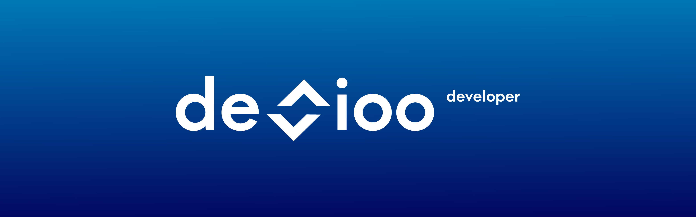

## 🧑🏽‍💻 About Me:

I have recently completed the Java Developer course at CodersLab, which has provided me with a solid foundation to kick-start my career in IT. I am fascinated by the opportunity to create applications and solve problems that have a real impact on people's lives. The rapid growth of the IT industry inspires me to continuously improve and learn. 👨‍💻💞

To further enhance my skills, I have decided to participate in a two-month React course. I am eager to expand my knowledge and stay up to date with the latest trends in the industry to achieve success as a programmer. I am driven by the constant pursuit of growth and I am excited about the endless possibilities that lie ahead in this dynamic field. 📈⚙️

## 🌐 Socials:
 

## 💻 Tech Stack:
                  

## 📊 GitHub Stats:
 
 

## 🏆 GitHub Trophies

## 🔝 Top Contributed Repo

---

<!-- Proudly created with GPRM ( https://gprm.itsvg.in ) -->
